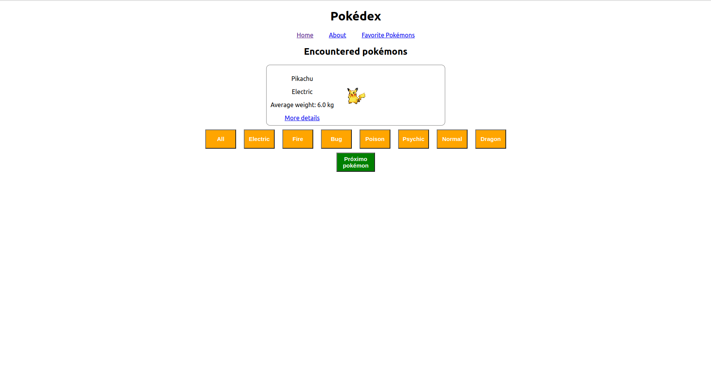

# React Testing Library

Neste projeto, implementei testes para uma aplicação React que foi criada e configurada pela Trybe, utilizando Jest e a biblioteca React Testing Library.
A aplicação contém uma implementação completa de todos os requisitos da Pokédex. Meu objetivo foi, para cada requisito listado, escrever testes que garantam sua corretude, atentando-se aos falsos positivos.

Para isso, tive as habilidades de:

  * Utilizar os seletores (queries) da React-Testing-Library em testes automatizados;

  * Simular eventos com a React-Testing-Library em testes automatizados;

  * Testar fluxos lógicos assíncronos com a React-Testing-Library;

  * Escrever testes que permitam a refatoração da estrutura dos componentes da aplicação sem necessidade de serem alterados;

  * Testar inputs.


## Referência

 - [React Testing Library](https://testing-library.com/docs/react-testing-library/intro/)


## Rodando localmente

Clone o projeto

```bash
  git clone git@github.com:MarcoViana0303/react-testing-library.git
```

Entre no diretório do projeto

```bash
  cd sd-024-a-project-react-testing-library
```

Instale as dependências

```bash
  npm install
```

Inicie o servidor

```bash
  npm run start
```


## Rodando os testes

Para rodar os testes, rode o seguinte comando

```bash
  npm run test
```

## Ilustração do projeto


## Feedback

Encontrou algum erro ou está com alguma dúvida? Não deixe de entrar em contato comigo!


## 🔗 Links
[](https://www.linkedin.com/in/marco-viana2022/)
[](https://marcoviana.dev@gmail.com/)
[](https://marcoviana-dev.vercel.app/)

